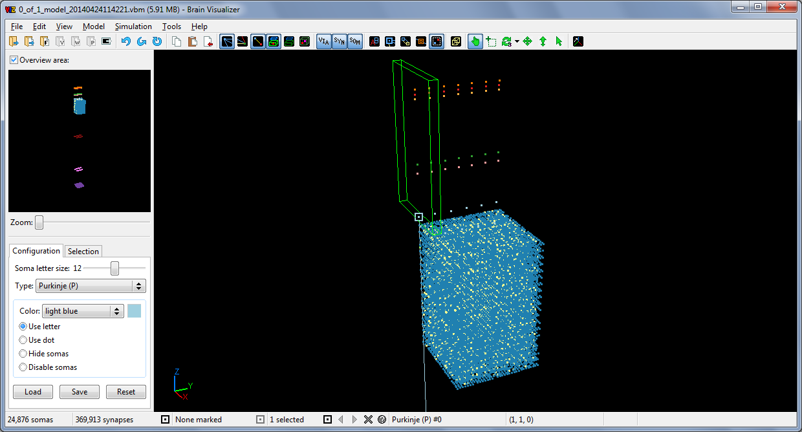

# Viz (Brain Visualizer)

An interactive visualizer for large-scale 3D brain models. Part of the Brain Organization Simulation System (BOSS) developed at Stony Brook University.

Developed from December 2012 to April 2016 by Remy Oukaour. BOSS is the work of Larry Wittie, Jack Zito, Heraldo Memelli, and Irene Solomon.

This code is made public for reference use only under the Microsoft Reference Source License ([Ms-RSL](https://referencesource.microsoft.com/license.html)).

[CLOC](https://github.com/AlDanial/cloc) output for `src`:

    -------------------------------------------------------------------------------
    Language                     files          blank        comment           code
    -------------------------------------------------------------------------------
    C++                             37            943            908          13914
    C/C++ Header                    40            245             12           2558
    -------------------------------------------------------------------------------
    SUM:                            77           1188            920          16472
    -------------------------------------------------------------------------------

